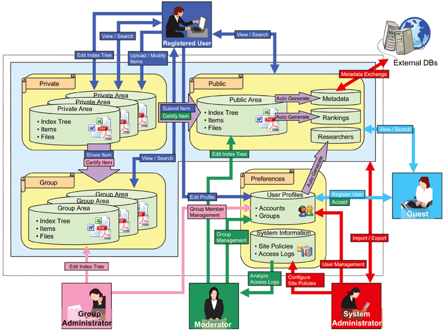

### _XOOPS Documentation Series_

# XooNIps Developer Guide
#### for XOOPS 2.5.8

Module Version 3.45

Tutorial Version 3.40
      

            
## Developer Guide

© 2016 XOOPS Project ([www.xoops.org](http://xoops.org)),   [XooNIps](http://xoonips.osdn.jp/), [Riken](http://www.riken.jp/)   

## Tutorial Purpose 

This document describes the creation process of the item type module (hereinafter the System) that is needed for XooNIps. 

To create XOOPS module, PHP and MySQL know-how is required.

*Figure 1: Main view of the XXX Module (Admin side)*

## Download/Fork the Module  

**You can fork the module --> [here](https://github.com/neuroinformatics/xoops-module-xoonips))** 

## How to Contribute

[You can contribute on GitHub](https://github.com/XoopsDocs/XXX-tutorial). Changes will be [pushed to Gitbook.io automatically](https://www.gitbook.com/book/xoops/xoonips-developerguide/activity) when the [main repository](https://github.com/XoopsDocs/xoonips-developerguide) changes.

Editing the book can be done either by updating the markdown files with a text editor, or opening the repository in [the Gitbook desktop app](https://github.com/GitbookIO/editor/blob/master/README.md). The desktop app will give you a live preview option.

# Table of Content

* [Item Type Module Creation Guide](book/itemtype/intro.md)
* [Common Library Function List Guide](book/commonlib/intro.md)
* [Credits](book/9credits.md)
* [About XOOPS CMS](book/10aboutxoops.md)

##License:

 Unless specified, this content is licensed under a <a rel="license" href="http://creativecommons.org/licenses/by-nc-sa/4.0/">Creative Commons Attribution-NonCommercial-ShareAlike 4.0 International License</a>.

All derivative works are to be attributed to XOOPS Project ([www.xoops.org](http://xoops.org))
