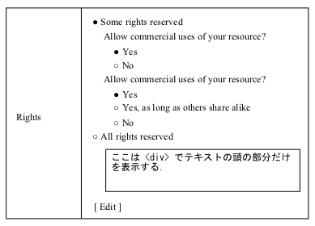

##Chapter 8 Rights {#8-rights}

It handles Copyrights, License or the Creative Commons: see Chapter 7\. _TextFile_ for more information．

## 1\. array xnpGetRightsDetailBlock( int item_id, int use_cc=1, string text=&#039;&#039;, int cc_commercial_use=1, int cc_modification=2 ) {#1-array-xnpgetrightsdetailblock-int-item-id-int-use-cc-1-string-text-int-cc-commercial-use-1-int-cc-modification-2}

### 1.1\. Inpet {#1-1}

* use_cc: Select 1 if selecting Some rights reserved, 0 if not

* text: urlencode License Text

* cc_commercial_use: Select 1 if you allow for Commercial use, 0 if not

* cc_modification: Select 2 if you allow for adaptation/alteration, 1 if you allow conditionally, 0 if not

### 1.2\. Referenced in the internal $_POST variable {#1-2-post}

None

### 1.3\. Screen {#1-3}

If you select Some rights reserved will be displayed as follows:

If you select All rights reserved, the screen will be the same as in Chapter 1\. [array xnpGetTextFileDetailBlock( int item_id, string name, string text )] 

### 1.4\. Submit Data {#1-4}

None

## 2\. array xnpGetRightsEditBlock( int item_id, int use_cc=1, string text=&#039;&#039;, int cc_commercial_use=1, int cc_modification=2 ) {#2-array-xnpgetrightseditblock-int-item-id-int-use-cc-1-string-text-int-cc-commercial-use-1-int-cc-modification-2}

### 2.1\. Input {#2-1}

* use_cc : Some rights reservedを選択なら1，そうでないなら0

* text : urlencodeされたLicense Text

* cc_commercial_use : 営利目的利用を許すなら1, そうでないなら0

* cc_modification : 翻案・改変を許すなら2, 条件付で許すなら1, そうでないなら0

※ $_POST[&quot;rightsUseCC&quot;]があれば，これらの引数は全て無視されて以下の$_POST変数が使用されます．

### 2.2\. Referenced in the internal $_POST variable {#2-2-post}

* $_POST[&quot;rightsUseCC&quot;] = Some rights reservedを選択なら1，そうでないなら0．

* $_POST[&quot;rightsEncText&quot;] = urlencodeされたLicense Text

* $_POST[&quot;rightsCCCommercialUse&quot;] = 営利目的利用を許すなら1, そうでないなら0

* $_POST[&quot;rightsCCModification&quot;] = 翻案・改変を許すなら2, 条件付で許すなら1, そうでないなら0

### 2.3\. Screenshot {#2-3}

### 2.4\. Submit Data {#2-4}

If you click on the "Submit" button → it will open the "Confirmation" screen

* $_POST[&quot;rightsEncText&quot;]

* $_POST[&quot;rightsUseCC&quot;]

* $_POST[&quot;rightsCCCommercialUse&quot;]

* $_POST[&quot;rightsCCModification&quot;]

## 3\. array xnpGetRightsConfirmBlock( int item_id, int maxlen=65535 ) {#3-array-xnpgetrightsconfirmblock-int-item-id-int-maxlen-65535}

To generate the HTML for the Confirm screen.

### 3.1\. Referenced in the internal $_POST variable {#3-1-post}

* $_POST[&quot;rightsEncText&quot;]

* $_POST[&quot;rightsUseCC&quot;]

* $_POST[&quot;rightsCCCommercialUse&quot;]

* $_POST[&quot;rightsCCModification&quot;]

### 3.2\. Screenshot {#3-2}

Same as → Chapter 1\. 「array xnpGetRightsDetailBlock( int item_id, int use_cc=1, string text=&#039;&#039;, int cc_commercial_use=1, int cc_modification=2 )」 

### 3.3\. Submit Data {#3-3}

* $_POST[&quot;rightsEncText&quot;]

* $_POST[&quot;rightsUseCC&quot;]

* $_POST[&quot;rightsCCCommercialUse&quot;]

* $_POST[&quot;rightsCCModification&quot;]

### 3.4\. Input {#3-4}

* maxlen : column of DB size

## 4\. array xnpGetRightsRegisterBlock( ) {#4-array-xnpgetrightsregisterblock}

→ Same as Chapter 2\. [array xnpGetRightsEditBlock( int item_id, int use_cc=1, string text=&#039;&#039;, int cc_commercial_use=1, int cc_modification=2 )] 

## 5\. array xnpGetRights() {#5-array-xnpgetrights}

Transmitted data sequence shows in the Confirm screen ( $text, $use_cc, $cc_commercial_use, $cc_modification ) and return it to. Each item type module records the string obtained in this function to the DB.
