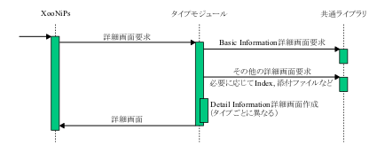

 <body>

 

 

 

 

 

 

 

 <h2 xmlns="http://www.w3.org/1999/xhtml" class="title">第11章 アイテム詳細画面</h2>

 

 

 

 
アイテムの詳しい情報を表示します．処理の流れは図 6のとおりです．

 

 

 

 

 

 

 

 

 <b>図 11.1. アイテム詳細画面表示の流れ</b>

 

 

  

 
アイテムタイプモジュールの以下の関数に詳細画面作成処理を定義してください．システムは詳細画面が必要なときこの関数をコールバックします．

 

 <ul type="disc">

 <li>

 
function &lt;モジュール名&gt;GetDetailBlock( $item_id )

 

 <ul type="circle">

 <li>

 
引数 : アイテムID

 </li>

 <li>

 
戻り値 : 詳細画面の HTML

 </li>

 </ul>

 

 </li>

 </ul>

 

 
ユーザがアイテムを編集する権限を持つなら，詳細画面のHTMLに以下のようなフォームを含めて下さい．

 

 <blockquote class="blockquote">

 <pre class="programlisting">

&lt;form id='xoonips_edit_form'&gt;

 &lt;input type='hidden' ... &gt;

&lt;/form&gt;

 </pre>

 </blockquote>

 

 
このフォームは詳細画面の「公開インデックスに登録」ボタンを押したときに確認画面に送信されます．

 アイテム登録画面・編集画面が送信するのと同じデータを送信するよう，適切なinputタグを入れる必要があります．

 

 
もし詳細画面の生成で関数xnpGetAttachmentDetailBlockを使用するなら，引数download_file_idをxnpGetDownloadConfirmationBlockに渡し，その結果をHTMLに含めてください．

 

 

 

 

 <h2 xmlns="http://www.w3.org/1999/xhtml" class="title" style="clear: both">1. Basic Information のフォーム生成</h2>

 

 

 

 
共通ライブラリに Basic Information の詳細画面用フォームを作成する関数があります．その関数を呼び出して，Basic Information のフォームを取得します．Basic Information のフィールド毎のフォームが得られるので，その中から必要なフィールドを取り出して組合せ，Basic Information の詳細画面を作成します．

 
以下の項目も参照してください．

 

 <ul type="disc">

 <li>

 
xnpGetBasicInformationDetailBlock

 </li>

 </ul>

 

 

 

 

 

 

 <h2 xmlns="http://www.w3.org/1999/xhtml" class="title" style="clear: both">2. Detail Informationのフォーム生成</h2>

 

 

 

 
Detail Information の詳細画面の作成はアイテムタイプで自由に定義できます．添付ファイル，インデックス，画像などは共有ライブラリに関数が用意されているのでそれを利用できます．

 
最後に，Basic Information と Detail Information のフォームをまとめて戻り値とします．

 
以下の項目も参照してください．

 

 <ul type="disc">

 <li>

 
xnpGetPreviewDetailBlock

 </li>

 <li>

 
xnpGetAttachmentDetailBlock

 </li>

 <li>

 
xnpGetTextFileDetailBlock

 </li>

 <li>

 
xnpGetRightsDetailBlock

 </li>

 <li>

 
xnpGetIndexDetailBlock

 </li>

 </ul>

 

 

 

 

 

 
Last updated: 2010/04/15

 

 </body>

