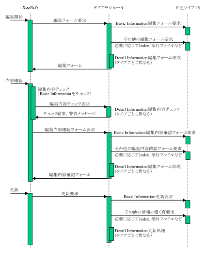
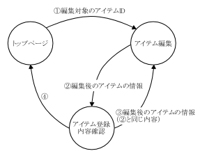

 <body>

 

 

 

 

 

 

 

 <h2 xmlns="http://www.w3.org/1999/xhtml" class="title">第8章 アイテム編集</h2>

 

 

 

 
アイテムの内容を更新します．

 

 

 

 

 

 

 

 

 <b>図 8.1. アイテム編集の流れ</b>

 

 

  

 

 

 

 

 

 

 

 

 <b>図 8.2. 画面遷移と送信パラメータ</b>

 

 

  

 

 

 

 

 <h2 xmlns="http://www.w3.org/1999/xhtml" class="title" style="clear: both">1. 編集フォーム要求</h2>

 

 

 

 
アイテムタイプモジュールは編集要求を受けて，編集フォームを作成します．編集フォームは HTML の形式で出力します．

 
アイテムタイプモジュールの以下の関数に編集フォーム作成処理を定義してください．システムは編集フォームが必要なときこの関数をコールバックします．

 

 <ul type="disc">

 <li>

 
function &lt;モジュール名&gt;GetEditBlock( )

 

 <ul type="circle">

 <li>

 
引数 : なし

 </li>

 <li>

 
戻り値 : 編集フォームの HTML

 </li>

 </ul>

 

 </li>

 </ul>

 

 

 

 

 

 <h3 xmlns="http://www.w3.org/1999/xhtml" class="title">1.1. Basic Information の編集フォーム作成</h3>

 

 

 

 
共通ライブラリの機能を呼び出して，Basic Information の編集フォームを作成します．Basic Information のフィールド毎のフォームが得られるので，その中から必要なフィールドを取り出してフォームを作成します．

 
以下の項目も参照してください．

 

 <ul type="disc">

 <li>

 
xnpGetBasicInformationEditBlock

 </li>

 </ul>

 

 

 

 

 

 

 <h3 xmlns="http://www.w3.org/1999/xhtml" class="title">1.2. Detail Information の編集フォーム作成</h3>

 

 

 

 
Detail Information の編集フォームの作成方法は規定しません．出力する HTML がシステムの画面構成や動作を妨げないものであれば，どのように作成しても問題ありません．共通ライブラリに用意された機能を利用して，添付ファイルや画像の編集フォームを生成できます．

 
システムから編集対象のアイテム ID (<a href="edit.html#fig.edit.view-parameter" title="図 8.2. 画面遷移と送信パラメータ">図 8.2. 「画面遷移と送信パラメータ」</a> の(1)) を指定されるので，その ID を使って DB に記録された値を取得し編集フォームの初期値に設定します．内容確認画面から編集フォームへ戻ってきた場合(<a href="edit.html#fig.edit.view-parameter" title="図 8.2. 画面遷移と送信パラメータ">図 8.2. 「画面遷移と送信パラメータ」</a> の(3)) は，POST で与えられた情報を優先してフォームの初期値に設定してください POST されない情報は，アイテム ID を使って DB から取得して設定してください．

 
以下の項目も参照してください．

 

 <ul type="disc">

 <li>

 
xnpGetBasicInformationEditBlock

 </li>

 <li>

 
xnpGetPreviewEditBlock

 </li>

 <li>

 
xnpGetAttachmentEditBlock

 </li>

 <li>

 
xnpGetTextFileEditBlock

 </li>

 <li>

 
xnpGetRightsFileEditBlock

 </li>

 <li>

 
xnpGetIndexEditBlock

 </li>

 <li>

 
xnpGetDownloadLimitationOptionEditBlock

 </li>

 <li>

 
xnpGetDownloadNotificationOptionEditBlock

 </li>

 </ul>

 

 

 

 

 

 

 <h3 xmlns="http://www.w3.org/1999/xhtml" class="title">1.3. パラメータチェック関数</h3>

 

 

 

 
Web ブラウザ上でパラメータチェックを行なうチェック関数を，出力する HTML に定義してください．JavaScript で以下の関数を定義してください．パラメータチェックを行なわない場合も定義が必要です．

 

 <ul type="disc">

 <li>

 
OnSubmitItemType( form )

 </li>

 <li>

 
引数 : form (編集フォームのオブジェクト)

 </li>

 <li>

 
戻り値 : true (異常なし)，false (異常あり)

 </li>

 </ul>

 

 
フォームの Submit ボタンが押されると，OnSubmitItemType 関数がコールバックされます．アイテムタイプ独自の項目で，パラメータチェックが必要な場合はこの関数内にチェック処理を行ないます．エラーダイアログ表示などはこの関数内で行なってください．最後に，パラメータが正常な場合は true を，異常がある場合は false をかえしてください．パラメータチェックを行なわない場合は常に true をかえす処理を定義してください．

 
falseを返した場合，編集内容確認画面へは進みません．

 

 

 

 

 

 <h3 xmlns="http://www.w3.org/1999/xhtml" class="title">1.4. 予約済みパラメータ名</h3>

 

 

 

 
システムが編集フォームで使用する (編集フォームから POST で送信する) パラメータの名前 (&lt;input&gt; タグの name 属性) は以下のとおりです．アイテムタイプモジュールが使用するパラメータが以下の名前と重複しないように注意してください．重複を避けるために Detail Information のパラメータ名にはプレフィクスとしてモジュール名を与えるとよいでしょう．

 

 <ul type="disc">

 <li>

 
mode

 </li>

 <li>

 
fileID

 </li>

 <li>

 
title

 </li>

 <li>

 
keywords

 </li>

 <li>

 
description

 </li>

 <li>

 
doi

 </li>

 <li>

 
change_log

 </li>

 <li>

 
publicationDateYear

 </li>

 <li>

 
publicationDateMonth

 </li>

 <li>

 
publicationDateDay

 </li>

 <li>

 
publicationDate

 </li>

 <li>

 
item_id

 </li>

 <li>

 
lang

 </li>

 <li>

 
related_to

 </li>

 <li>

 
scrollX

 </li>

 <li>

 
scrollY

 </li>

 <li>

 
xoonipsCheckedXID

 </li>

 <li>

 
jump_to_var[]

 </li>

 </ul>

 

 

 

 

 

 

 

 <h2 xmlns="http://www.w3.org/1999/xhtml" class="title" style="clear: both">2. 編集内容確認フォーム要求</h2>

 

 

 

 
編集内容を確認するフォームを生成します．HTML で出力します．システムはアイテムタイプに対して以下の処理を行ないます．

 

 <ul type="disc">

 <li>

 
パラメータチェック関数のコールバック

 </li>

 <li>

 
変更フィールドチェック関数のコールバック

 </li>

 <li>

 
編集内容確認フォームの要求

 </li>

 </ul>

 

 
アイテムタイプモジュールの以下の関数に編集内容確認フォーム作成処理を定義してください．システムは編集内容確認フォームが必要なときこの関数をコールバックします．この関数は登録内容確認画面で使用するものと同じです．

 

 <ul type="disc">

 <li>

 
function &lt;モジュール名&gt;GetConfirmBlock( $item_id )

 

 <ul type="circle">

 <li>

 
引数 : $item_id (確認したいアイテムの ID)

 </li>

 <li>

 
戻り値 : 内容確認画面のHTML

 </li>

 </ul>

 

 </li>

 </ul>

 

 

 

 

 

 <h3 xmlns="http://www.w3.org/1999/xhtml" class="title">2.1. パラメータチェック関数のコールバック</h3>

 

 

 

 
アイテムタイプは編集内容をチェックするための PHP 関数を定義します．関数の概要は以下のとおりです．

 

 <ul type="disc">

 <li>

 
書式 : &lt;モジュール名&gt;CheckEditParameters( &amp;$msg )

 </li>

 <li>

 
引数 : $msg (チェックしたパラメータのエラーや警告メッセージを代入する)

 </li>

 <li>

 
戻り値 : true (異常なし)，false (異常あり)

 </li>

 </ul>

 

 
この関数内で Detail Information のパラメータチェックを行ないます．パラメータに異常があれば，その内容を示すメッセージを $msg 引数に設定し，false を返して関数を終了します．異常が無ければ true を返します．false を返した場合，システムは更新処理実行を禁止します．$msg の内容は編集内容確認画面に出力されます．

 

 

 

 

 

 <h3 xmlns="http://www.w3.org/1999/xhtml" class="title">2.2. 変更フィールドチェック関数のコールバック</h3>

 

 

 

 
ChangeLog欄が空白の場合に限りChangeLogを自動的に生成します．アイテムタイプモジュールはXooNIpsの要求に応じて，変更されたDetail Informationのフィールド名を返さなければなりません．

 

 <ul type="disc">

 <li>

 
書式 : &lt;モジュール名&gt;GetModifiedFields( $item_id )

 </li>

 <li>

 
引数 : $item_id(比較対象のアイテムのID)

 </li>

 <li>

 
戻り値 : フィールド名の配列

 </li>

 </ul>

 

 
DB に記録された Detail Information と， $_POSTで与えられる Detail Information の値の違いを調べ，違いが見付かったフィールドの表示名の配列を戻り値とします．

 

 

 

 

 

 <h3 xmlns="http://www.w3.org/1999/xhtml" class="title">2.3. Basic Information の編集内容確認フォーム作成</h3>

 

 

 

 
共通ライブラリの機能を呼び出して，Basic Information の編集内容確認フォームを作成します．Basic Information のフィールド毎のフォームが得られるので，その中から必要なフィールドを取り出して組合せ，フォームを作成します．

 
以下の項目も参照してください．

 

 <ul type="disc">

 <li>

 
xnpGetBasicInformationConfirmBlock

 </li>

 </ul>

 

 

 

 

 

 

 <h3 xmlns="http://www.w3.org/1999/xhtml" class="title">2.4. Detail Information の編集内容確認フォーム作成</h3>

 

 

 

 
以下の条件を満たしていれば，Detail Information の編集内容確認フォームの作成方法は規定しません．

 

 <ul type="disc">

 <li>

 
Detail Information の各フィールド値を次ページへ送信するための &lt;input type='hidden'&gt; タグをつける

 </li>

 <li>

 
送信するパラメータに予約済みパラメータ名を使用しない

 </li>

 <li>

 
出力するHTMLがシステムの画面構成や動作を妨げない

 </li>

 </ul>

 

 
共通ライブラリに用意された機能を利用して，添付ファイルや画像の編集内容確認フォームを生成できます．

 
以下の項目も参照してください．

 

 <ul type="disc">

 <li>

 
xnpGetBasicInformationConfirmBlock

 </li>

 <li>

 
xnpGetPreviewConfirmBlock

 </li>

 <li>

 
xnpGetAttachmentConfirmBlock

 </li>

 <li>

 
xnpGetTextFileConfirmBlock

 </li>

 <li>

 
xnpGetRightsConfirmBlock

 </li>

 <li>

 
xnpGetIndexConfirmBlock

 </li>

 <li>

 
xnpGetDownloadLimitationOptionConfirmBlock

 </li>

 <li>

 
xnpGetDownloadNotificationOptionConfirmBlock

 </li>

 </ul>

 

 

 

 

 

 

 <h3 xmlns="http://www.w3.org/1999/xhtml" class="title">2.5. 予約済みパラメータ名</h3>

 

 

 

 
システムが使用する (POST で送信する) パラメータの名前 (&lt;input&gt; タグの name 属性) は以下のとおりです．アイテムタイプモジュールが使用するパラメータが以下の名前と重複しないように注意してください．重複を避けるために Detail Information のパラメータ名にはプレフィクスとしてモジュール名を与えるとよいでしょう．

 

 <ul type="disc">

 <li>

 
mode

 </li>

 <li>

 
fileID

 </li>

 <li>

 
title

 </li>

 <li>

 
keywords

 </li>

 <li>

 
description

 </li>

 <li>

 
doi

 </li>

 <li>

 
change_log

 </li>

 <li>

 
publicationDateYear

 </li>

 <li>

 
publicationDateMonth

 </li>

 <li>

 
publicationDateDay

 </li>

 <li>

 
publicationDate

 </li>

 <li>

 
item_id

 </li>

 <li>

 
lang

 </li>

 <li>

 
related_to

 </li>

 <li>

 
scrollX

 </li>

 <li>

 
scrollY

 </li>

 <li>

 
xoonipsCheckedXID

 </li>

 <li>

 
op

 </li>

 <li>

 
related_to_check

 </li>

 </ul>

 

 

 

 

 

 

 

 <h2 xmlns="http://www.w3.org/1999/xhtml" class="title" style="clear: both">3. アイテム更新要求</h2>

 

 

 

 
システムからの要求を受けて，アイテム更新処理を実行します．アイテムタイプモジュールの以下の関数に更新処理を定義してください．システムは更新処理が必要なときこの関数をコールバックします．編集フォームに入力された情報は$_POST配列から取得します．

 

 <ul type="disc">

 <li>

 
function &lt;モジュール名&gt;UpdateItem( )

 

 <ul type="circle">

 <li>

 
引数 : なし

 </li>

 <li>

 
戻り値 : true (成功)，false (失敗)

 </li>

 </ul>

 

 </li>

 </ul>

 

 

 

 

 

 <h3 xmlns="http://www.w3.org/1999/xhtml" class="title">3.1. Basic Informationの更新</h3>

 

 

 

 
共通ライブラリにBasic Information更新関数が用意されています．その関数を呼び出してください．呼び出すときに，更新するアイテムのアイテムIDを引数に指定します．

 
以下の項目も参照してください．

 

 <ul type="disc">

 <li>

 
xnpUpdateBasicInformation

 </li>

 </ul>

 

 

 

 

 

 

 <h3 xmlns="http://www.w3.org/1999/xhtml" class="title">3.2. Detail Informationの更新</h3>

 

 

 

 
Detail Informationを更新する処理を定義します．

 
添付ファイル，画像ファイル，テキストの更新には共通ライブラリを使用できます．Detail Informationの更新方法，DBの使用，DBの種類，処理方法は規定しませんので自由に定義してください．

 
以下の項目も参照してください．

 

 <ul type="disc">

 <li>

 
xnpUpdateBasicInformation

 </li>

 <li>

 
xnpUpdateIndex

 </li>

 <li>

 
xnpUpdateAttachment

 </li>

 <li>

 
xnpUpdatePreview

 </li>

 </ul>

 

 

 

 

 

 

 
Last updated: 2010/04/15

 

 </body>

</html>

