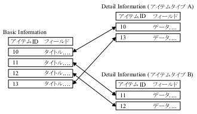

# Chapter 2 Overview of items

Information of the item is divided into in the following manner:  
* Basic Information and 
* Detail Information

##1. Basic Information
Information that all of the items owned regardless of the item type (the field) is called the Basic Information. This has the following items.

* title
* keyword
* comment
* DOI
* Date on the contents of the items [1]
* Creating a user
* Created date
* last updated
* language

Of these, creating a user, creation date, last update date is determined system. The user can not be specified.

Registration and retrieve from the DB to the DB of the Basic Information, parameter check, part of the form creation process is responsible for the system. Item type module author does not need to create these processes. Because it is provided in the form of a function in a common library, you can use to call if necessary.

##2. Detail Information

It refers to the item type-specific information that is not included in the Basic Information. Handling of Detail Information are all done the item type module. Recording method and the processing method can be freely determined by the item type.

##3. Relatioship between Basic Information and Detail Information

Information about one of the items as described above are managed is divided into two of the Basic Information and Detail Information. Item ID exists in order to take the correspondence between the two. Item type module, please management in association with the item ID and Detail Information given from the system. The system will handle the Basic Information and Detail Information with the same item ID as one of items ( Figure 2.1. "Association by item ID (for example)" ).

 

 <b> 2.1. Correspondence by item ID (for example) </b>

 
 

 
[<a id="ftn.id360007" href="#id360007">1</a>] 
Item paper if paper issue date, to specify such as with the release if the program date. Or date is meant what will vary by item type. There is also an item type that does not use date. 

