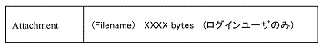
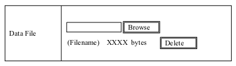
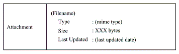

# attachment {#attachment}

## 第6章 Attachment {#6-attachment}

アイテムにファイルを添付したい場合に使用します．($name 引数については 章 14\. _補足: Attachment, TextFile 系関数の $name 引数について_ を参照)

## 1\. array xnpGetAttachmentDetailBlock( int item_id, string name ) {#1-array-xnpgetattachmentdetailblock-int-item-id-string-name}

アイテム詳細画面に表示するフォームを作成します．ファイル名とサイズを表示します．ファイルをダウンロードするにはファイル名をクリックします．

### 1.1\. 内部で参照する $_POST 変数 {#1-1-post}

なし

### 1.2\. 画面 {#1-2}

誰でもダウンロード可能な場合

> 

ログインユーザのみダウンロード可能, かつログインユーザの場合

> 

ログインユーザのみダウンロード可能, かつゲストユーザの場合

> 

### 1.3\. 送信データ {#1-3}

なし

## 2\. array xnpGetAttachmentEditBlock( int item_id, string name ) {#2-array-xnpgetattachmenteditblock-int-item-id-string-name}

アイテム編集画面に表示するフォームを作成します．アップロードするファイルの指定と，アップ済みファイルの情報とその削除ボタンを表示します．

### 2.1\. 内部で参照する $_POST 変数 {#2-1-post}

* $_POST[&#039;mode&#039;]

* $_POST[&#039;fileID&#039;]

* $_POST[&quot;${name}FileID&quot;]

### 2.2\. 画面 {#2-2}

> 

### 2.3\. 送信データ {#2-3}

Delete ボタン → 現在の画面へ以下を送信する．

* $_POST[&#039;mode&#039;] = &#039;Delete&#039;

* $_POST[&quot;${name}FileID&quot;] = $file_id

* $_POST[&#039;fileID&#039;]

Submit ボタン → 確認画面へ以下を送信する

* $_POST[&#039;mode&#039;]

* $_POST[&quot;${name}FileID&quot;]

* $_FILES[&quot;${name}&quot;]

## 3\. array xnpGetAttachmentConfirmBlock( int item_id, string name ) {#3-array-xnpgetattachmentconfirmblock-int-item-id-string-name}

登録確認画面，編集確認画面に表示するフォームを作成します．

### 3.1\. 内部で参照する $_POST 変数 {#3-1-post}

* $_POST[&quot;${name}FileID&quot;]

* $_FILES[&quot;${name}&quot;]

### 3.2\. 画面 {#3-2}

> 

### 3.3\. 送信データ {#3-3}

* $_POST[&quot;${name}FileID&quot;] = $file_id

## 4\. array xnpGetAttachmentRegisterBlock( string name ) {#4-array-xnpgetattachmentregisterblock-string-name}

→ 項2\. 「array xnpGetAttachmentEditBlock( int item_id, string name )」 と同じ

## 5\. xnpInsertAttachemnt : (無し) {#5-xnpinsertattachemnt}

代わりに 項6\. 「bool xnpUpdateAttachment( int item_id, string name )」 を使用してください

## 6\. bool xnpUpdateAttachment( int item_id, string name ) {#6-bool-xnpupdateattachment-int-item-id-string-name}

添付ファイルをアイテムに登録します．既に添付ファイルがある場合はその情報を上書きします．

### 6.1\. 内部で参照する $_POST 変数 {#6-1-post}

* $_POST[&#039;fileID&#039;]

## 7\. xnpDeleteAttachemnt : (無し) {#7-xnpdeleteattachemnt}

項9\. 「bool xnpDeleteBasicInformation( int item_id )」 が Attachment の削除を行うので，この関数はありません．

## 8\. bool xnpGetDownloadLimitationOptionRegisterBlock( string dirname, int option = 0 ) {#8-bool-xnpgetdownloadlimitationoptionregisterblock-string-dirname-int-option-0}

添付ファイルのダウンロード制限を登録するフォームを生成します．アイテムタイプがアイテム登録画面を作成する際に使用します．

dirname引数で添付ファイルが属するモジュールのフォルダ名を指定します．option引数で，制限の初期値を指定します．1でログインユーザに限定，0で全てのユーザに解放，を意味します．option引数省略時のデフォルト値は0です．

$_POST[&#039;attachment_dl_limit&#039;]が定義されている場合はoption引数の値は無視されます．

### 8.1\. 内部で参照する $_POST 変数 {#8-1-post}

* $_POST[&#039;attachment_dl_limit&#039;]

### 8.2\. 送信データ {#8-2}

* $_POST[&#039;attachment_dl_limit&#039;]

## 9\. bool xnpGetDownloadLimitationOptionEditBlock( string dirname, int option ) {#9-bool-xnpgetdownloadlimitationoptioneditblock-string-dirname-int-option}

添付ファイルのダウンロード制限を編集するフォームを生成します．アイテムタイプがアイテム編集画面を作成する際に使用します．

dirname引数で添付ファイルが属するモジュールのフォルダ名を指定します．option引数で，制限の初期値を指定します．1でログインユーザに限定，0で全てのユーザに解放，を意味します．

$_POST[&#039;attachment_dl_limit&#039;]が定義されている場合はoption引数の値は無視されます．

### 9.1\. 内部で参照する $_POST 変数 {#9-1-post}

* $_POST[&#039;attachment_dl_limit&#039;]

### 9.2\. 送信データ {#9-2}

* $_POST[&#039;attachment_dl_limit&#039;]

## 10\. bool xnpGetDownloadLimitationOptionConfirmBlock( string dirname ) {#10-bool-xnpgetdownloadlimitationoptionconfirmblock-string-dirname}

添付ファイルのダウンロード制限を確認するフォームを生成します．

dirname引数で添付ファイルが属するモジュールのフォルダ名を指定します．

### 10.1\. 内部で参照する $_POST 変数 {#10-1-post}

* $_POST[&#039;attachment_dl_limit&#039;]

### 10.2\. 送信データ {#10-2}

* $_POST[&#039;attachment_dl_limit&#039;]

## 11\. bool xnpGetDownloadNotificationOptionRegisterBlock( string dirname, int option = 0 ) {#11-bool-xnpgetdownloadnotificationoptionregisterblock-string-dirname-int-option-0}

添付ファイルのダウンロード通知を登録するフォームを生成します．アイテムタイプがアイテム登録画面を作成する際に使用します．

dirname引数で添付ファイルが属するモジュールのフォルダ名を指定します．option引数で，通知の初期値を指定します．1で通知する，0で通知しない，を意味します．option引数省略時のデフォルト値は0です．

$_POST[&#039;attachment_dl_notify&#039;]が定義されている場合はoption引数の値は無視されます．

### 11.1\. 内部で参照する $_POST 変数 {#11-1-post}

* $_POST[&#039;attachment_dl_notify&#039;]

### 11.2\. 送信データ {#11-2}

* $_POST[&#039;attachment_dl_notify&#039;]

## 12\. bool xnpGetDownloadNotificationOptionEditBlock( string dirname, int option ) {#12-bool-xnpgetdownloadnotificationoptioneditblock-string-dirname-int-option}

添付ファイルのダウンロード通知を編集するフォームを生成します．アイテムタイプがアイテム編集画面を作成する際に使用します．

dirname引数で添付ファイルが属するモジュールのフォルダ名を指定します．option引数で，通知の初期値を指定します．1で通知する，0で通知しない，を意味します．

$_POST[&#039;attachment_dl_notify&#039;]が定義されている場合はoption引数の値は無視されます．

### 12.1\. 内部で参照する $_POST 変数 {#12-1-post}

* $_POST[&#039;attachment_dl_notify&#039;]

### 12.2\. 送信データ {#12-2}

* $_POST[&#039;attachment_dl_notify&#039;]

## 13\. bool xnpGetDownloadNotificationOptionConfirmBlock( string dirname ) {#13-bool-xnpgetdownloadnotificationoptionconfirmblock-string-dirname}

添付ファイルのダウンロード通知を確認するフォームを生成します．

dirname引数で添付ファイルが属するモジュールのフォルダ名を指定します．

### 13.1\. 内部で参照する $_POST 変数 {#13-1-post}

* $_POST[&#039;attachment_dl_notify&#039;]

### 13.2\. 送信データ {#13-2}

* $_POST[&#039;attachment_dl_notify&#039;]

## 14\. bool xnpGetDownloadConfirmationBlock( int item_id, int download_file_id, bool attachment_dl_notify, bool use_license, int use_cc, string rights ) {#14-bool-xnpgetdownloadconfirmationblock-int-item-id-int-download-file-id-bool-attachment-dl-notify-bool-use-license-int-use-cc-string-rights}

添付ファイルのダウンロード前に合意を求めるポップアップを表示するブロックを生成します。

download_file_id引数がfalseでないなら，download_file_idで指定されたファイルのダウンロードボタンを自動で押します．falseなら押しません． attachment_dl_notifyがtrueならダウンロード前にダウンロード通知の合意を求め，falseなら求めません． use_licenseがtrueならダウンロード前にライセンスの合意を求め，falseなら求めません．

rightsにはライセンス文を指定します．use_ccには，rightsがテキスト形式なら0を指定し，HTML形式なら1を指定します．

attachment_dl_notifyとuse_licenseの片方でもtrueなら，ユーザは求められた全ての合意で「合意します」を選択しないとファイルをダウンロードできません．

### 14.1\. 内部で参照する $_POST 変数 {#14-1-post}

* なし

### 14.2\. 送信データ {#14-2}

* $_POST[&#039;file_id&#039;]

* $_POST[&#039;xoonips_download_with_token&#039;]

* (XOOPSのXoopsToken．名前は&#039;xoonips_download_token&#039;)

