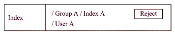
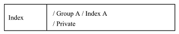

# itemindex {#itemindex}

## 第4章 Index {#4-index}

## 1\. array xnpGetIndexDetailBlock( int item_id, bool button_flag = true ) {#1-array-xnpgetindexdetailblock-int-item-id-bool-button-flag-true}

アイテム詳細画面の Index 欄に表示するフォームを生成する．

### 1.1\. 内部で参照する $_POST 変数 {#1-1-post}

なし

### 1.2\. 画面 {#1-2}

> 

※ インデックスの右側のボタン，表示は閲覧者ごとに以下の様に場合分けされる (図は Reject ボタン の例)．

* モデレータ

 * 承認済みの Public インデックス，Group インデックス

 * Reject ボタンを表示

 * 承認待ちの Public インデックス，Group インデックス

 * Accetpt ボタンを表示

 * Reject ボタンを表示

* 承認権限を持つグループ管理者

 * 承認済みの Group インデックス

 * Reject ボタンを表示

 * 承認待ちの Public インデックス

 * 文字列 &#039;(Pending)&#039;を表示

 * 承認待ちの Group インデックス

 * Accept ボタンを表示

 * Reject ボタンを表示

 * 承認権限を持たないグループ管理者

 * 承認待ちのインデックス

 * 文字列 &#039;(Pending)&#039; を表示

 * アイテム作成者

 * 承認待ちの Public インデックス，Group インデックス

 * 文字列 &#039;(Pending)&#039; を表示

 * 上記以外のユーザ，ゲスト

 * 承認待ちの Public インデックス，Group インデックス

 * 文字列 &#039;(Pending)&#039;を表示

※ 各ボタンの働きは以下の通り

* Reject ボタン，Withdraw ボタン

 * 承認待ち状態を未承認へ変更する．

 * 二つのボタンはラベルが異なるだけで働きは同じ．

* Accept ボタン

 * 承認待ち状態を承認済みへ変更する．

※ インデックスキーワードをクリックすると，そのキーワードに属するアイテムの一覧を表示する．

### 1.3\. 送信データ {#1-3}

* Reject ボタン，Withdraw ボタン

 * フォーム (name = &#039;cancel_certify&#039;) に以下のパラメータをセットして submit する

 * index_id = 承認を取り消すインデックスの ID

 * item_id = 承認を取り消すアイテムの ID

 * op = &#039;cancel_certify&#039;

* Accept ボタン

 * フォーム (name = &#039;accept_certify&#039;) に以下のパラメータをセットして submit する

 * index_id = 承認するインデックスのID

 * item_id = 承認するアイテムのID

 * op = &#039;accept_certify&#039;

* ボタンに共通する事柄

 * ボタン押下時に JavaScript のダイアログで OK/Cancel を問い合わせる．

 * フォームは `detail.php` の Smarty テンプレートに定義する．

## 2\. array xnpGetIndexEditBlock( int item_id ) {#2-array-xnpgetindexeditblock-int-item-id}

アイテム編集画面の Index 欄に表示するフォームを生成します．

### 2.1\. 内部で参照する $_POST 変数 {#2-1-post}

* $_POST[&#039;xnpindexCheckedXID&#039;]

### 2.2\. 画面 {#2-2}

$_POST[&#039;xnpindexCheckedXID&#039;] に指定されたインデックスキーワードを以下の様に表示します．

> 

### 2.3\. 送信データ {#2-3}

なし

## 3\. array xnpGetIndexConfirmBlock( int item_id ) {#3-array-xnpgetindexconfirmblock-int-item-id}

登録確認画面，編集確認画面の Index 欄のフォームを生成します．

### 3.1\. 内部で参照する $_POST 変数 {#3-1-post}

* $_POST[&#039;xnpindexCheckedXID&#039;]

### 3.2\. 画面 {#3-2}

$_POST[&#039;xnpindexCheckedXID&#039;] に指定されたインデックスキーワードを以下の様に表示します．

> 

### 3.3\. 送信データ {#3-3}

なし

## 4\. array xnpGetIndexRegisterBlock() {#4-array-xnpgetindexregisterblock}

アイテム登録画面の Index 欄に表示するフォームを生成します．

### 4.1\. 内部で参照する $_POST 変数 {#4-1-post}

* $_POST[&#039;xnpindexCheckedXID&#039;]

### 4.2\. 画面 {#4-2}

$_POST[&#039;xnpindexCheckedXID&#039;] に指定されたインデックスキーワードを以下の様に表示します．

> 

### 4.3\. 送信データ {#4-3}

なし

## 5\. xnpInsertIndex : (無し) {#5-xnpinsertindex}

代わりに 項6\. 「bool xnpUpdateIndex( int item_id )」 を使用してください．

## 6\. bool xnpUpdateIndex( int item_id ) {#6-bool-xnpupdateindex-int-item-id}

引数 item_id で指定されるアイテムを，選択されたインデックスに登録します．選択を解除されたインデックスから登録を抹消します．

グループ管理者，モデレータの承認が必要な設定であれば，インデックスに対応する管理者のメールアドレスに承認要求メールを送信します．

### 6.1\. 内部で参照する $_POST 変数 {#6-1-post}

選択されたインデックスキーワードを以下の変数から取得します．

* $_POST[&#039;xnpindexCheckedXID&#039;]

## 7\. xnpDeleteIndex : (無し) {#7-xnpdeleteindex}

項9\. 「bool xnpDeleteBasicInformation( int item_id )」 が Index の削除を行うので，この関数はありません．

<?xml version="1.0" encoding="UTF-8" standalone="no"?>

<!DOCTYPE html PUBLIC "-//W3C//DTD XHTML 1.0 Transitional//EN" "http://www.w3.org/TR/xhtml1/DTD/xhtml1-transitional.dtd">

<html xmlns="http://www.w3.org/1999/xhtml">

 <head xmlns="http://www.w3.org/1999/xhtml">

 <meta http-equiv="Content-Type" content="text/html; charset=UTF-8" />

 <title>第4章 Index</title>

 <link rel="stylesheet" href="style.css" type="text/css" />

 <meta name="generator" content="DocBook XSL Stylesheets V1.72.0" />

 <link rel="start" href="index.html" title="XooNIps" />

 <link rel="up" href="index.html" title="XooNIps" />

 <link rel="prev" href="basicinfo.html" title="第3章 Basic Information" />

 <link rel="next" href="preview.html" title="第5章 Preview" />

 </head>

 <body>

 

 

 <table width="100%" summary="Navigation header">

 <tr>

 <td width="20%" align="left"> </td>

 <th width="60%" align="center"> </th>

 <td width="20%" align="right"> </td>

 </tr>

 </table>

 

 

 

 

 

 

 <h2 xmlns="http://www.w3.org/1999/xhtml" class="title">第4章 Index</h2>

 

 

 

 

 

 

 

 <h2 xmlns="http://www.w3.org/1999/xhtml" class="title" style="clear: both">1. array xnpGetIndexDetailBlock( int item_id, bool button_flag = true )</h2>

 

 

 

 
アイテム詳細画面の Index 欄に表示するフォームを生成する．

 

 

 

 

 <h3 xmlns="http://www.w3.org/1999/xhtml" class="title">1.1. 内部で参照する $_POST 変数</h3>

 

 

 

 
なし

 

 

 

 

 

 <h3 xmlns="http://www.w3.org/1999/xhtml" class="title">1.2. 画面</h3>

 

 

 

 

 <blockquote class="blockquote">

 

 

 

 

 

 </blockquote>

 

 
※ インデックスの右側のボタン，表示は閲覧者ごとに以下の様に場合分けされる (図は Reject ボタン の例)．

 

 <ul type="disc">

 <li>

 
モデレータ

 

 <ul type="circle">

 <li>

 
承認済みの Public インデックス，Group インデックス

 

 <ul type="square">

 <li>

 
Reject ボタンを表示

 </li>

 </ul>

 

 </li>

 <li>

 
承認待ちの Public インデックス，Group インデックス

 

 <ul type="square">

 <li>

 
Accetpt ボタンを表示

 </li>

 <li>

 
Reject ボタンを表示

 </li>

 </ul>

 

 </li>

 </ul>

 

 </li>

 <li>

 
承認権限を持つグループ管理者

 

 <ul type="circle">

 <li>

 
承認済みの Group インデックス

 

 <ul type="square">

 <li>

 
Reject ボタンを表示

 </li>

 </ul>

 

 </li>

 <li>

 
承認待ちの Public インデックス

 

 <ul type="square">

 <li>

 
文字列 '(Pending)'を表示

 </li>

 </ul>

 

 </li>

 <li>

 
承認待ちの Group インデックス

 

 <ul type="square">

 <li>

 
Accept ボタンを表示

 </li>

 <li>

 
Reject ボタンを表示

 </li>

 </ul>

 

 </li>

 <li>

 
承認権限を持たないグループ管理者

 

 <ul type="square">

 <li>

 
承認待ちのインデックス

 

 <ul type="disc">

 <li>

 
文字列 '(Pending)' を表示

 </li>

 </ul>

 

 </li>

 </ul>

 

 </li>

 <li>

 
アイテム作成者

 

 <ul type="square">

 <li>

 
承認待ちの Public インデックス，Group インデックス

 

 <ul type="disc">

 <li>

 
文字列 '(Pending)' を表示

 </li>

 </ul>

 

 </li>

 </ul>

 

 </li>

 <li>

 
上記以外のユーザ，ゲスト

 

 <ul type="square">

 <li>

 
承認待ちの Public インデックス，Group インデックス

 

 <ul type="disc">

 <li>

 
文字列 '(Pending)'を表示

 </li>

 </ul>

 

 </li>

 </ul>

 

 </li>

 </ul>

 

 </li>

 </ul>

 

 
※ 各ボタンの働きは以下の通り

 

 <ul type="disc">

 <li>

 
Reject ボタン，Withdraw ボタン

 

 <ul type="circle">

 <li>

 
承認待ち状態を未承認へ変更する．

 </li>

 <li>

 
二つのボタンはラベルが異なるだけで働きは同じ．

 </li>

 </ul>

 

 </li>

 <li>

 
Accept ボタン

 

 <ul type="circle">

 <li>

 
承認待ち状態を承認済みへ変更する．

 </li>

 </ul>

 

 </li>

 </ul>

 

 
※ インデックスキーワードをクリックすると，そのキーワードに属するアイテムの一覧を表示する．

 

 

 

 

 

 <h3 xmlns="http://www.w3.org/1999/xhtml" class="title">1.3. 送信データ</h3>

 

 

 

 

 <ul type="disc">

 <li>

 
Reject ボタン，Withdraw ボタン

 

 <ul type="circle">

 <li>

 
フォーム (name = 'cancel_certify') に以下のパラメータをセットして submit する

 

 <ul type="square">

 <li>

 
index_id = 承認を取り消すインデックスの ID

 </li>

 <li>

 
item_id = 承認を取り消すアイテムの ID

 </li>

 <li>

 
op = 'cancel_certify'

 </li>

 </ul>

 

 </li>

 </ul>

 

 </li>

 <li>

 
Accept ボタン

 

 <ul type="circle">

 <li>

 
フォーム (name = 'accept_certify') に以下のパラメータをセットして submit する

 

 <ul type="square">

 <li>

 
index_id = 承認するインデックスのID

 </li>

 <li>

 
item_id = 承認するアイテムのID

 </li>

 <li>

 
op = 'accept_certify'

 </li>

 </ul>

 

 </li>

 </ul>

 

 </li>

 <li>

 
ボタンに共通する事柄

 

 <ul type="circle">

 <li>

 
ボタン押下時に JavaScript のダイアログで OK/Cancel を問い合わせる．

 </li>

 <li>

 
フォームは <code class="filename">detail.php</code> の Smarty テンプレートに定義する．

 </li>

 </ul>

 

 </li>

 </ul>

 

 

 

 

 

 

 

 <h2 xmlns="http://www.w3.org/1999/xhtml" class="title" style="clear: both">2. array xnpGetIndexEditBlock( int item_id )</h2>

 

 

 

 
アイテム編集画面の Index 欄に表示するフォームを生成します．

 

 

 

 

 <h3 xmlns="http://www.w3.org/1999/xhtml" class="title">2.1. 内部で参照する $_POST 変数</h3>

 

 

 

 

 <ul type="disc">

 <li>

 
$_POST['xnpindexCheckedXID']

 </li>

 </ul>

 

 

 

 

 

 

 <h3 xmlns="http://www.w3.org/1999/xhtml" class="title">2.2. 画面</h3>

 

 

 

 
$_POST['xnpindexCheckedXID'] に指定されたインデックスキーワードを以下の様に表示します．

 

 <blockquote class="blockquote">

 

 

 

 

 

 </blockquote>

 

 

 

 

 

 

 <h3 xmlns="http://www.w3.org/1999/xhtml" class="title">2.3. 送信データ</h3>

 

 

 

 
なし

 

 

 

 

 

 

 <h2 xmlns="http://www.w3.org/1999/xhtml" class="title" style="clear: both">3. array xnpGetIndexConfirmBlock( int item_id )</h2>

 

 

 

 
登録確認画面，編集確認画面の Index 欄のフォームを生成します．

 

 

 

 

 <h3 xmlns="http://www.w3.org/1999/xhtml" class="title">3.1. 内部で参照する $_POST 変数</h3>

 

 

 

 

 <ul type="disc">

 <li>

 
$_POST['xnpindexCheckedXID']

 </li>

 </ul>

 

 

 

 

 

 

 <h3 xmlns="http://www.w3.org/1999/xhtml" class="title">3.2. 画面</h3>

 

 

 

 
$_POST['xnpindexCheckedXID'] に指定されたインデックスキーワードを以下の様に表示します．

 

 <blockquote class="blockquote">

 

 

 

 

 

 </blockquote>

 

 

 

 

 

 

 <h3 xmlns="http://www.w3.org/1999/xhtml" class="title">3.3. 送信データ</h3>

 

 

 

 
なし

 

 

 

 

 

 

 <h2 xmlns="http://www.w3.org/1999/xhtml" class="title" style="clear: both">4. array xnpGetIndexRegisterBlock()</h2>

 

 

 

 
アイテム登録画面の Index 欄に表示するフォームを生成します．

 

 

 

 

 <h3 xmlns="http://www.w3.org/1999/xhtml" class="title">4.1. 内部で参照する $_POST 変数</h3>

 

 

 

 

 <ul type="disc">

 <li>

 
$_POST['xnpindexCheckedXID']

 </li>

 </ul>

 

 

 

 

 

 

 <h3 xmlns="http://www.w3.org/1999/xhtml" class="title">4.2. 画面</h3>

 

 

 

 
$_POST['xnpindexCheckedXID'] に指定されたインデックスキーワードを以下の様に表示します．

 

 <blockquote class="blockquote">

 

 

 

 

 

 </blockquote>

 

 

 

 

 

 

 <h3 xmlns="http://www.w3.org/1999/xhtml" class="title">4.3. 送信データ</h3>

 

 

 

 
なし

 

 

 

 

 

 

 <h2 xmlns="http://www.w3.org/1999/xhtml" class="title" style="clear: both">5. xnpInsertIndex : (無し)</h2>

 

 

 

 
代わりに <a href="itemindex.html#func-xnpUpdateIndex" title="6. bool xnpUpdateIndex( int item_id )">項6. 「bool xnpUpdateIndex( int item_id )」</a> を使用してください．

 

 

 

 

 

 <h2 xmlns="http://www.w3.org/1999/xhtml" class="title" style="clear: both">6. bool xnpUpdateIndex( int item_id )</h2>

 

 

 

 
引数 item_id で指定されるアイテムを，選択されたインデックスに登録します．選択を解除されたインデックスから登録を抹消します．

 
グループ管理者，モデレータの承認が必要な設定であれば，インデックスに対応する管理者のメールアドレスに承認要求メールを送信します．

 

 

 

 

 <h3 xmlns="http://www.w3.org/1999/xhtml" class="title">6.1. 内部で参照する $_POST 変数</h3>

 

 

 

 
選択されたインデックスキーワードを以下の変数から取得します．

 

 <ul type="disc">

 <li>

 
$_POST['xnpindexCheckedXID']

 </li>

 </ul>

 

 

 

 

 

 

 

 <h2 xmlns="http://www.w3.org/1999/xhtml" class="title" style="clear: both">7. xnpDeleteIndex : (無し)</h2>

 

 

 

 
<a href="basicinfo.html#func-xnpDeleteBasicInformation" title="9. bool xnpDeleteBasicInformation( int item_id )">項9. 「bool xnpDeleteBasicInformation( int item_id )」</a> が Index の削除を行うので，この関数はありません．

 

 

 

 

 <table width="100%" summary="Navigation footer">

 <tr>

 <td width="40%" align="left"> </td>

 <td width="20%" align="center"> </td>

 <td width="40%" align="right"> </td>

 </tr>

 <tr>

 <td width="40%" align="left" valign="top"> </td>

 <td width="20%" align="center">

 

 </td>

 <td width="40%" align="right" valign="top"> </td>

 </tr>

 </table>

 

 
Last updated: 2010/04/15

 

 </body>

</html>

