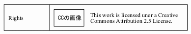

 <body>

 

 

 

 

 

 

 

 <h2 xmlns="http://www.w3.org/1999/xhtml" class="title">第8章 Rights</h2>

 

 

 

 
Rightsを取り扱います．Creative Commonsのライセンスまたは<a href="textfile.html" title="第7章 TextFile">章 7. <i>TextFile</i></a>同様の長文を設定可能です．

 

 

 

 

 <h2 xmlns="http://www.w3.org/1999/xhtml" class="title" style="clear: both">1. array xnpGetRightsDetailBlock( int item_id, int use_cc=1, string text='', int cc_commercial_use=1, int cc_modification=2 )</h2>

 

 

 

 

 

 

 

 <h3 xmlns="http://www.w3.org/1999/xhtml" class="title">1.1. 入力</h3>

 

 

 

 

 <ul type="disc">

 <li>

 
use_cc : Some rights reservedを選択なら1，そうでないなら0

 </li>

 <li>

 
text : urlencodeされたLicense Text

 </li>

 <li>

 
cc_commercial_use : 営利目的利用を許すなら1, そうでないなら0

 </li>

 <li>

 
cc_modification : 翻案・改変を許すなら2, 条件付で許すなら1, そうでないなら0

 </li>

 </ul>

 

 

 

 

 

 

 <h3 xmlns="http://www.w3.org/1999/xhtml" class="title">1.2. 内部で参照する $_POST 変数</h3>

 

 

 

 
なし

 

 

 

 

 

 <h3 xmlns="http://www.w3.org/1999/xhtml" class="title">1.3. 画面</h3>

 

 

 

 
Some rights reservedを選択した場合は以下のように表示されます．

 

 <blockquote class="blockquote">

 

 

 

 

 

 </blockquote>

 

 
All rights reservedを選択した場合は、<a href="textfile.html#func-xnpGetTextFileDetailBlock" title="1. array xnpGetTextFileDetailBlock( int item_id, string name, string text )">項1. 「array xnpGetTextFileDetailBlock( int item_id, string name, string text )」</a> と同じです

 

 

 

 

 

 <h3 xmlns="http://www.w3.org/1999/xhtml" class="title">1.4. 送信データ</h3>

 

 

 

 
なし

 

 

 

 

 

 

 <h2 xmlns="http://www.w3.org/1999/xhtml" class="title" style="clear: both">2. array xnpGetRightsEditBlock( int item_id, int use_cc=1, string text='', int cc_commercial_use=1, int cc_modification=2 )</h2>

 

 

 

 

 

 

 

 <h3 xmlns="http://www.w3.org/1999/xhtml" class="title">2.1. 入力</h3>

 

 

 

 

 <ul type="disc">

 <li>

 
use_cc : Some rights reservedを選択なら1，そうでないなら0

 </li>

 <li>

 
text : urlencodeされたLicense Text

 </li>

 <li>

 
cc_commercial_use : 営利目的利用を許すなら1, そうでないなら0

 </li>

 <li>

 
cc_modification : 翻案・改変を許すなら2, 条件付で許すなら1, そうでないなら0

 </li>

 </ul>

 

 
※ $_POST["rightsUseCC"]があれば，これらの引数は全て無視されて以下の$_POST変数が使用されます．

 

 

 

 

 

 <h3 xmlns="http://www.w3.org/1999/xhtml" class="title">2.2. 内部で参照する $_POST 変数</h3>

 

 

 

 

 <ul type="disc">

 <li>

 
$_POST["rightsUseCC"] = Some rights reservedを選択なら1，そうでないなら0．

 </li>

 <li>

 
$_POST["rightsEncText"] = urlencodeされたLicense Text

 </li>

 <li>

 
$_POST["rightsCCCommercialUse"] = 営利目的利用を許すなら1, そうでないなら0

 </li>

 <li>

 
$_POST["rightsCCModification"] = 翻案・改変を許すなら2, 条件付で許すなら1, そうでないなら0

 </li>

 </ul>

 

 

 

 

 

 

 <h3 xmlns="http://www.w3.org/1999/xhtml" class="title">2.3. 画面</h3>

 

 

 

 

 <blockquote class="blockquote">

 

 

 

 

 

 </blockquote>

 

 

 

 

 

 

 <h3 xmlns="http://www.w3.org/1999/xhtml" class="title">2.4. 送信データ</h3>

 

 

 

 
Submit ボタン → 確認画面へ

 

 <ul type="disc">

 <li>

 
$_POST["rightsEncText"]

 </li>

 <li>

 
$_POST["rightsUseCC"]

 </li>

 <li>

 
$_POST["rightsCCCommercialUse"]

 </li>

 <li>

 
$_POST["rightsCCModification"]

 </li>

 </ul>

 

 

 

 

 

 

 

 <h2 xmlns="http://www.w3.org/1999/xhtml" class="title" style="clear: both">3. array xnpGetRightsConfirmBlock( int item_id, int maxlen=65535 )</h2>

 

 

 

 
Confirm 画面用の HTML を生成する．

 

 

 

 

 <h3 xmlns="http://www.w3.org/1999/xhtml" class="title">3.1. 内部で参照する $_POST 変数</h3>

 

 

 

 

 <ul type="disc">

 <li>

 
$_POST["rightsEncText"]

 </li>

 <li>

 
$_POST["rightsUseCC"]

 </li>

 <li>

 
$_POST["rightsCCCommercialUse"]

 </li>

 <li>

 
$_POST["rightsCCModification"]

 </li>

 </ul>

 

 

 

 

 

 

 <h3 xmlns="http://www.w3.org/1999/xhtml" class="title">3.2. 画面</h3>

 

 

 

 
→ <a href="rights.html#func-xnpGetRightsDetailBlock" title="1. array xnpGetRightsDetailBlock( int item_id, int use_cc=1, string text='', int cc_commercial_use=1, int cc_modification=2 )">項1. 「array xnpGetRightsDetailBlock( int item_id, int use_cc=1, string text='', int cc_commercial_use=1, int cc_modification=2 )」</a> と同じ

 

 

 

 

 

 <h3 xmlns="http://www.w3.org/1999/xhtml" class="title">3.3. 送信データ</h3>

 

 

 

 

 <ul type="disc">

 <li>

 
$_POST["rightsEncText"]

 </li>

 <li>

 
$_POST["rightsUseCC"]

 </li>

 <li>

 
$_POST["rightsCCCommercialUse"]

 </li>

 <li>

 
$_POST["rightsCCModification"]

 </li>

 </ul>

 

 

 

 

 

 

 <h3 xmlns="http://www.w3.org/1999/xhtml" class="title">3.4. 入力</h3>

 

 

 

 

 <ul type="disc">

 <li>

 
maxlen : DBのカラムサイズ

 </li>

 </ul>

 

 

 

 

 

 

 

 <h2 xmlns="http://www.w3.org/1999/xhtml" class="title" style="clear: both">4. array xnpGetRightsRegisterBlock( )</h2>

 

 

 

 
→ <a href="rights.html#func-xnpGetRightsEditBlock" title="2. array xnpGetRightsEditBlock( int item_id, int use_cc=1, string text='', int cc_commercial_use=1, int cc_modification=2 )">項2. 「array xnpGetRightsEditBlock( int item_id, int use_cc=1, string text='', int cc_commercial_use=1, int cc_modification=2 )」</a> と同じ

 

 

 

 

 

 <h2 xmlns="http://www.w3.org/1999/xhtml" class="title" style="clear: both">5. array xnpGetRights()</h2>

 

 

 

 
Confirm 画面で送信したデータを配列 ( $text, $use_cc, $cc_commercial_use, $cc_modification ) にして返す．各アイテムタイプモジュールは，この関数で得た文字列を DB に記録する．

 

 

 

 

 

 </body>

