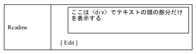
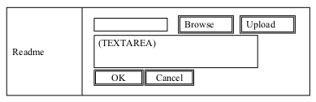

## 第7章 TextFile {#7-textfile}

Plain Text を取り扱います．主に長文入力を想定したフォームで，キー入力の代わりにテキストファイルの内容を読み込むことが出来ます．キー入力も可能です．

($name 引数については 章 14\. _補足: Attachment, TextFile 系関数の $name 引数について_ を参照)

## 1\. array xnpGetTextFileDetailBlock( int item_id, string name, string text ) {#1-array-xnpgettextfiledetailblock-int-item-id-string-name-string-text}

### 1.1\. 内部で参照する $_POST 変数 {#1-1-post}

なし

### 1.2\. 画面 {#1-2}

※ Add as Text ・Add as File どちらで登録してもこの表示になる．

※ 引数のtextを，&lt;TEXTAREA&gt; … &lt;/TEXTAREA&gt;で表示する．

> 

### 1.3\. 送信データ {#1-3}

なし

## 2\. array xnpGetTextFileEditBlock( int item_id, string name, string text ) {#2-array-xnpgettextfileeditblock-int-item-id-string-name-string-text}

※ Text を外から引数として与える必要があります．

### 2.1\. 内部で参照する $_POST 変数 {#2-1-post}

* $_POST[&quot;${name}EncText&quot;]

### 2.2\. 画面 {#2-2}

画面は Readme 入力画面説明.ppt を参照

> 

ここで Edit リンクを押すと以下のウィンドウが開く

> 

ここで OK ボタンを押すとウィンドウが閉じ，TEXTAREA のデータが元のフォームに転送される．Cancel ボタンを押すと単にウィンドウが閉じるのみ．

### 2.3\. 送信データ {#2-3}

Upload ボタン →

* $_FILES[&#039;text&#039;]

* $_POST[&#039;name&#039;]

Submit ボタン → 確認画面へ

* $_POST[&quot;${name}EncText&quot;]

## 3\. array xnpGetTextFileConfirmBlock( int item_id, string name, int maxlen=65535 ) {#3-array-xnpgettextfileconfirmblock-int-item-id-string-name-int-maxlen-65535}

Confirm 画面用の HTML を生成する．

### 3.1\. 内部で参照する $_POST 変数 {#3-1-post}

* $_POST[&quot;${name}EncText&quot;]

### 3.2\. 画面 {#3-2}

> 

### 3.3\. 送信データ {#3-3}

* $_POST[&quot;${name}EncText&quot;]

### 3.4\. 入力 {#3-4}

* maxlen : DBのカラムサイズ)

## 4\. array xnpGetTextFileRegisterBlock( string name ) {#4-array-xnpgettextfileregisterblock-string-name}

→ 項2\. 「array xnpGetTextFileEditBlock( int item_id, string name, string text )」 と同じ

## 5\. string xnpGetTextFile( string name ) {#5-string-xnpgettextfile-string-name}

Confirm 画面の Submit でロードされるページで $_POST[&quot;${name}EncText&quot;] を得るための関数である．各アイテムタイプモジュールは，この関数で得た文字列を DB に記録する．

### 5.1\. 内部で参照する $_POST 変数 {#5-1-post}

* $_POST[&quot;${name}EncText&quot;]

### 5.2\. 戻り値 {#5-2}

array( &#039;value&#039;=&gt;入力された文字列の確認画面表示用html, &#039;within&#039;=&gt;入力された文字列から頭$maxlenバイトを切り出したもの, &#039;without&#039;=&gt;切り出した残り, &#039;html_string&#039;=&gt;入力された文字列のhtml )．